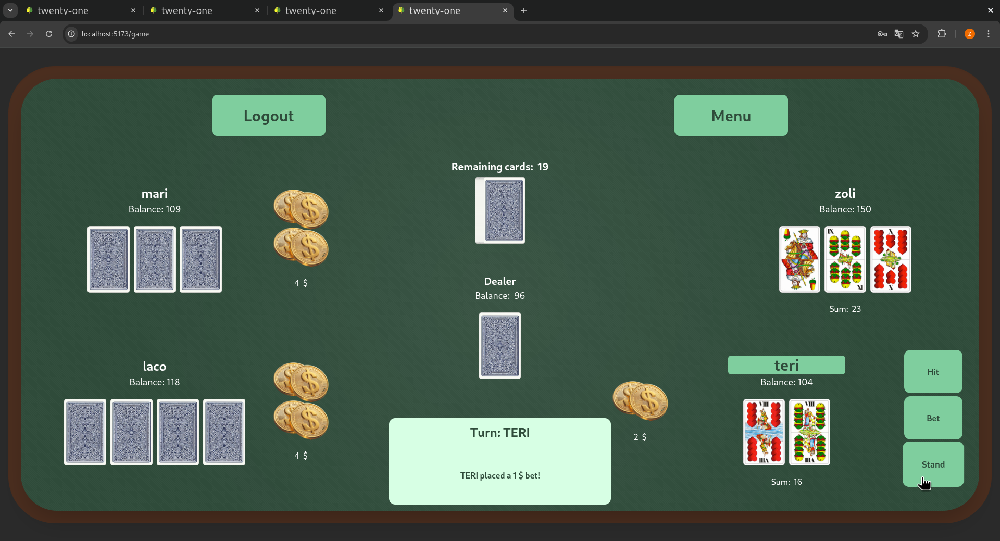

# Twenty-one (multiplayer version)

---

## 🚀 What is Twenty-one?

Twenty-one is an old card game with many local versions all around the world, especially in Europe.
This implementation follows the rules of the offline game "Huszonegyes", the Hungarian version of the game played by Hungarian pattern deck.


---

---

## 🚀 Features
- Websocket-based online game where up to four players can play at a table at the same time against the dealer (computer) <br>
There is no limit to the number of players overall; if there are more than four, another game starts at another table
- Follows the rules of offline game, for example:<br>
Only two aces in the hand: it pays immediately, does not need to wait for dealer's turn<br>
More than 21 in the hand: immediate loss, with one exception listed one line above<br>
Ohne ace announcement: if the player has 11 from at least two cards, they are entitled to declare *Ohne Ace*. If the next card is an ace, they may discard it and request another card<br>
5 cards in the hand with less value than 21: players are entitled to discard them and request another card<br>
Placing bet: after placing a bet players *must* request another card

- 💾 Automatic data persistence in PostgreSQL
- 🔐 JWT-based authentication
- 🎨 Modern UI with React + Tailwind

---

### Built With

- [![React][React.js]][React-url]
- [![Vite-url][Vite.js]][Vite-url]
- [![Java Spring Boot][Spring]][Spring-url]
- [![Spring WebSocket][Spring WebSocket]][WebSocket-url]
- [![PostgreSQL][PostgreSQL]][Postgres-url]
- [![Tailwind-url][Tailwind.js]][Tailwind-url]

<p align="right">(<a href="#readme-top">back to top</a>)</p>


### Prerequisites

- [Java 21+](https://adoptopenjdk.net/)
- [Maven](https://maven.apache.org/)
- [Node.js](https://nodejs.org/) (v22+ recommended)
- [npm](https://www.npmjs.com/)
- [PostgreSQL](https://www.postgresql.org/)

### Installation

1. **Clone the repo**
   ```sh
   git clone https://github.com/your-org/twenty-one-multiplayer.git
   cd twenty-one-multiplayer
   ```

2. **Install frontend dependencies**
   ```sh
   cd frontend
   npm install
   ```

3. **Set up backend**
   ```sh
   cd ../backend
   mvn clean install
   ```

4. **Configure database**

   - Create a PostgreSQL database named `twenty-one`
   - Update `backend/src/main/resources/application.properties` with your database credentials:
   ```properties
   spring.datasource.url=jdbc:postgresql://localhost:5432/twenty-one
   spring.datasource.username=your_username
   spring.datasource.password=your_password
   spring.jpa.hibernate.ddl-auto=update
   ```

5. **Run the backend server**
   ```sh
   cd backend
   mvn spring-boot:run
   ```

6. **Run the frontend development server (in another terminal)**
   ```sh
   cd frontend
   npm run dev
   ```

7. **Open [http://localhost:5173](http://localhost:5173) to view the application**

<!-- LICENSE -->

## License

Distributed under the MIT License. See `LICENSE` for more information.

---

## Contact

Project Link: [https://github.com/your-org/twenty-one-multiplayer](https://github.com/your-org/twenty-one-multiplayer)

---

## Acknowledgments

- [React](https://reactjs.org/)
- [Java Spring](https://spring.io/)
- [Websocket](https://spring.io/guides/gs/messaging-stomp-websocket)
- [PostgreSQL](https://www.postgresql.org/)
- [Tailwind CSS](https://tailwindcss.com/)
- [Vite](https://vitejs.dev/)
- [JWT](https://jwt.io/)

---

<!-- MARKDOWN LINKS & IMAGES -->


[product-screenshot]: public/screenshot.png
[React.js]: https://img.shields.io/badge/React-20232A?style=for-the-badge&logo=react&logoColor=61DAFB
[React-url]: https://react.dev/
[Vite.js]: https://img.shields.io/badge/Vite-646CFF?style=for-the-badge&logo=vite&logoColor=FFD62E
[Vite-url]: https://vitejs.dev/
[Spring]: https://img.shields.io/badge/Spring%20Boot-6DB33F?style=for-the-badge&logo=springboot&logoColor=white
[Spring-url]: https://spring.io/projects/spring-boot
[Spring WebSocket]: https://img.shields.io/badge/Spring%20websocket-brightgreen?style=for-the-badge
[WebSocket-url]: https://spring.io/guides/gs/messaging-stomp-websocket
[PostgreSQL]: https://img.shields.io/badge/PostgreSQL-4169E1?style=for-the-badge&logo=postgresql&logoColor=white
[Postgres-url]: https://www.postgresql.org/
[Tailwind.js]: https://img.shields.io/badge/Tailwind_CSS-38BDF8?style=for-the-badge&logo=tailwindcss&logoColor=white
[Tailwind-url]: https://tailwindcss.com/
